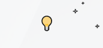
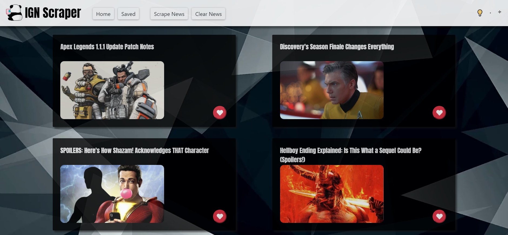
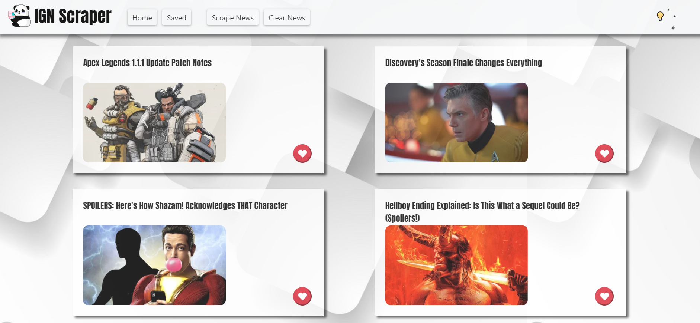

# 🎮 WEB Scraper

#### Check the news, save your favorites and leave notes!!

An app that allows users to scrape news, images, and many useful information from any websites with No API Needed, the demo was scraping data from IGN.com for an example. 
-	All scraped data will be saved to app database, and app support to clear database and scrape new. 
-	Users are also allowed to save their favorite news and leave notes or comments on each of them.

#### 🎮 Technologies
- [x] MongoDB Mongoose
- [x] Node Express
- [x] handlebars
- [x] Cheerio
- [x] JavaScript/JQuery
- [x] CSS/Bootstrap

#### 🎮 Author

[Isaac Wu](https://github.com/squall2046)
* [App demo](https://webscraper-iw.herokuapp.com/)

## Copyright
© 2019 All Rights Reserved
## 

Click 💡 to switch Light Theme or Dark Theme

